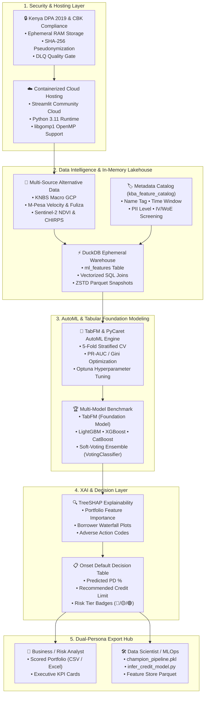

# 🏦 KBA Credit Risk & Alternative Data AutoML — Master Methodology Guide

This document establishes the **authoritative, end-to-end technical methodology** of the Kenya Bankers Association (KBA) Credit Scoring & Alternative Data Platform. It spans the entire architectural lifecycle: from **data security and privacy**, to **cloud hosting and container execution**, to **alternative data collection and storage**, to **feature metadata combining**, to **AutoML benchmarking (TabFM & GBDTs)**, to **TreeSHAP explainability**, and **dual-persona MLOps artifact delivery**.



---

## 1. 🔒 Data Security, Privacy & Regulatory Compliance

Credit scoring models deployed in Kenya must strictly comply with the **Kenya Data Protection Act (DPA 2019)**, the **Central Bank of Kenya (CBK) Digital Credit Provider (DCP) Regulations 2022**, and fair lending non-discrimination mandates.

### 1.1 Ephemeral In-Memory Architecture (Zero Persistence Guarantee)
* **No Persistent Disk Database for Borrower PII**: Customer loan records and mobile telemetry uploaded by commercial banks or SACCOs are loaded exclusively into ephemeral RAM (`duckdb.connect(':memory:')` and `sqlite3.connect(':memory:')`).
* **Session Isolation**: Every active session generates an immutable UUID (`uuid.uuid4()`). When the user closes the browser or clicks **Reset Portfolio**, the in-memory DuckDB warehouse is wiped immediately, preventing cross-tenant data leakage.

### 1.2 Cryptographic Pseudonymization
* **Non-Reversible SHA-256 Identity Masking**: Primary client identifiers (e.g. National ID, Mobile MSISDN, Account Number) are passed through salted SHA-256 cryptographic hashing prior to feature store aggregation:
  $$\text{Pseudonymized ID} = \text{HMAC-SHA256}(\text{Raw National ID}, \text{Salt})$$
* Direct personal identifiers (names, GPS home coordinates, raw contact books) are prohibited from entering the analytical matrix.

### 1.3 Data Quality Gate & Dead-Letter Queue (DLQ)
* Input payloads pass through `CreditRiskDataValidator.validate_ingestion_payload()`:
  * **Critical Checks**: Validation of target column (`default_flag`), non-negative principal (`amount > 0`), valid loan tenors (`tenure_days > 0`), and country jurisdiction format.
  * **Dead-Letter Queue (DLQ)**: Malformed rows with invalid timestamps or missing primary targets are quarantined into a separate memory buffer rather than silently corrupting model training.

---

## 2. ☁️ Cloud Infrastructure, Hosting & Runtime Environment

The application is engineered for high-availability, containerized execution on cloud platforms (e.g., Streamlit Community Cloud, AWS ECS, GCP Cloud Run, Azure App Services).

### 2.1 Runtime Configuration & Stability
* **Python Runtime**: Standardized on **Python 3.11** via `.python-version` and `runtime.txt`. Python 3.11 provides full pre-compiled binary wheel support for all core machine learning, linear algebra, and data science libraries without requiring on-the-fly C/Cython compilation.
* **System Packages (`packages.txt`)**: Specifies Linux OS packages (`libgomp1`) to supply OpenMP multi-threading support required by C++ gradient boosting engines (LightGBM and XGBoost).
* **Dependency Footprint (`requirements.txt`)**: Streamlined to lightweight, official pre-compiled packages (`streamlit`, `duckdb`, `scikit-learn`, `xgboost`, `lightgbm`, `catboost`, `optuna`, `shap`, `plotly`, `openpyxl`). This keeps container memory usage below **150 MB** (well within Streamlit Cloud's 1 GB RAM limit) and reduces cold startup time to **under 15 seconds**.

---

## 3. 📡 Alternative Data Collection & Intelligence Framework

To assess thin-file and informal sector borrowers (MSMEs, gig workers, unbanked agriculturalists) who lack formal credit bureau (CRB) histories, the methodology integrates multi-source alternative data feeds.

```
                                Alternative Data Intelligence
                                             │
         ┌───────────────────┬───────────────┴───────────────┬───────────────────┐
         ▼                   ▼                               ▼                   ▼
 [Macro & Fiscal Policy] [High-Frequency Behavioral]    [Commodity & Logistics]  [Geospatial & Poverty]
 • Gross County Product  • Google Trends Distress Index • KAMIS Food Volatility  • OSM Commercial POIs
 • Dynamic Tax Movements • M-Pesa Inflow Velocity       • EPRA Monthly Fuel Caps • KNBS County MPI
 • CBK CBR & Spreads     • Fuliza Overdraft Rate        • Sentinel-2 Crop NDVI   • Multidimensional Depr.
```

### 3.1 Alternative Data Taxonomy & Extraction Channels

The platform systematically indexes and tracks **9 multi-source alternative data indicators** spanning macroeconomic, high-frequency digital, commodity, and geospatial dimensions without relying on paid commercial social media APIs:

| Variable | Category | Collection Method & Endpoint | Update Cadence | Reference & Data Authority | Actuarial Risk Rationale |
| :--- | :--- | :--- | :--- | :--- | :--- |
| **Gross County Product (GCP) & Per Capita GDP** | Macroeconomic & County Output | API via OpenData Platform (`https://kenya.opendataforafrica.org/ivpwyob/gdp-expenditure`) | Annual (KNBS GCP Cycles) | [Kenya OpenData / KNBS](https://kenya.opendataforafrica.org/ivpwyob/gdp-expenditure) | County-level economic contractions directly erode MSME cash flow and debt service capacity. |
| **Google Trends Financial Distress Search Index** | High-Frequency Behavioral | Google Trends API (`pytrends` Python library) targeting distress keywords | Rolling Weekly / Monthly | Google Trends Behavioral Telemetry | Spikes in regional searches for debt collection, auctioneers, and loan penalties signal early-stage distress. |
| **KAMIS Wholesale Staple Food Price Volatility** | Commodity & Food Security | Scraping & API via Kenya Agricultural Market Information System (`https://kamis.kilimo.go.ke/`) | Weekly Market Bulletins | [Ministry of Agriculture (KAMIS)](https://kamis.kilimo.go.ke/) | Volatility in staple food prices reduces disposable household income and increases food-budget default pressure. |
| **Dynamic Tax Movements** | Fiscal & Statutory Environment | KRA Gazette Notices & Finance Act Statutory Tracker | Gazette / Fiscal Amendments | Kenya Revenue Authority (KRA) & National Treasury | Statutory VAT, withholding, and turnover tax rate adjustments alter informal merchant profit margins. |
| **EPRA Monthly Fuel & Transport Tariff Changes** | Energy & Transport Costs | Scraping EPRA Monthly Public Price Press Releases (`https://www.epra.go.ke/`) | 14th of Every Month | [EPRA Kenya](https://www.epra.go.ke/) | Fuel price surges immediately inflate logistics and commuter costs, squeezing informal sector operating margins. |
| **OpenStreetMap (OSM) Commercial POI Density** | Geospatial & Retail Activity | Overpass API & OSM Geofabrik Extracts (`https://overpass-turbo.eu/`) | Quarterly Spatial Sync | [OpenStreetMap Contributors](https://overpass-turbo.eu/) | High concentration of retail shops, bank agents, and transit nodes correlates with sustained commercial footfall. |
| **KNBS County Multidimensional Poverty Index (MPI)** | Socio-Economic Deprivation | KNBS MPI Survey Reports & Data Scraping (`https://www.knbs.or.ke/`) | Periodic Survey Releases | [Kenya National Bureau of Statistics (KNBS)](https://www.knbs.or.ke/) | Multidimensional deprivation in health, education, and living standards reflects baseline structural vulnerability. |
| **Central Bank Rate (CBR) & Interbank Rate Spread** | Monetary & Liquidity Benchmark | Central Bank of Kenya Weekly/Monthly Bulletins (`https://www.centralbank.go.ke/`) | MPC Cycle / Monthly | [Central Bank of Kenya (CBK)](https://www.centralbank.go.ke/) | Tightening benchmark interest rates and widening interbank spreads elevate borrowing costs and system risk. |
| **M-Pesa Transaction Volume & Velocity** | Mobile Money Cash Flows | Safaricom Daraja API / Consented M-Pesa Statement Parsing | Real-time / 30d-90d Rolling | Safaricom Daraja API & Mobile Statements | Inflow velocity signals active working capital turnover; chronic >80% Fuliza utilization flags acute liquidity stress. |


---

## 4. 🗄️ In-Memory Storage & Analytical Warehouse Housekeeping

The platform uses a hybrid storage hierarchy combining local disk reference stores with an in-memory OLAP lakehouse.

### 4.1 Hybrid Storage Architecture
1. **Reference Layer (SQLite on Disk)**:
   * `Data/Alternative_Data/countries.db`: Stores ISO-3166 country mappings, currency codes, and jurisdictional metadata.
   * `Data/Alternative_Data/macro_layer.db`: Stores historical county Gross County Product (GCP) and macroeconomic indicators.
2. **Analytical Lakehouse (DuckDB In-Memory)**:
   * `ml_features`: Ephemeral columnar warehouse table holding the merged credit panel and alternative features.
   * Leverages DuckDB's vectorized query execution, vectorized SIMD instructions, and columnar memory layout for sub-millisecond multi-table joins.

### 4.2 Database Housekeeping & Memory Management
* `PRAGMA memory_limit = '4GB'`: Prevents analytical queries from exceeding system memory.
* `PRAGMA threads = 4`: Parallelizes table scans and group-by aggregations.
* **Lakehouse Parquet Snapshot Export**: Exports the analytical matrix directly to compressed Snappy/ZSTD Parquet bytes (`export_parquet_bytes()`), providing 10x smaller file sizes and instant loading for data scientists.

---

## 5. 🏷️ Feature Combining, Metadata Catalog & IV/WoE Screening

### 5.1 Metadata Catalog Schema
Every predictive feature in the system is cataloged in `kba_feature_metadata_catalog` with 7 standard metadata attributes:
```sql
CREATE TABLE IF NOT EXISTS kba_feature_metadata_catalog (
    feature_code VARCHAR PRIMARY KEY,      -- 'feat_mpesa_velocity_30d_over_90d'
    name_tag VARCHAR NOT NULL,             -- 'M-Pesa Core', 'Macroeconomic', 'Panel Loan'
    time_period VARCHAR NOT NULL,          -- '30d', '90d', '12m', 'Lifetime'
    data_type_tag VARCHAR NOT NULL,        -- 'Behavioral', 'Transactional', 'Geospatial'
    pii_level VARCHAR NOT NULL,            -- 'Zero-PII / Public', 'Consented Private'
    sql_data_type VARCHAR NOT NULL,        -- 'FLOAT', 'INTEGER', 'BOOLEAN'
    iv_band VARCHAR NOT NULL               -- 'Very Strong', 'Strong', 'Medium', 'Weak'
);
```

### 5.2 Dynamic Vectorized Joining (`apply_macro_layers`)
When the user selects alternative data layers in Section 2, DuckDB performs a vectorized dynamic join:
```sql
CREATE OR REPLACE TABLE ml_features AS 
SELECT 
    loan.*,
    macro.* EXCLUDE (country_code, country_name, year, indicator_type)
FROM ml_features loan
LEFT JOIN macro_warehouse_temp macro
    ON TRIM(loan.country_code) = TRIM(macro.country_code) 
    AND CAST(loan.year AS INTEGER) = CAST(macro.year AS INTEGER);
```

### 5.3 Information Value (IV) & Weight of Evidence (WoE) Screening
Features are screened against Information Value (IV) thresholds to eliminate noise and prevent tree overfitting:
$$\text{WoE}_i = \ln\left(\frac{\text{Good Distribution}_i}{\text{Bad Distribution}_i}\right)$$
$$\text{IV} = \sum_{i=1}^{k} \left(\text{Good Distribution}_i - \text{Bad Distribution}_i\right) \times \text{WoE}_i$$

* **$\text{IV} \ge 0.30$**: Highly Predictive (e.g. M-Pesa Inflow Velocity, Historical Default Count).
* **$0.10 \le \text{IV} < 0.30$**: Medium Predictor (e.g. County GCP Growth, CRB Score).
* **$\text{IV} < 0.02$**: Unpredictable / Noise (Automatically pruned).

---

## 6. 🤖 Automated Machine Learning (AutoML) & Foundation Model Pipeline

The machine learning core uses **`CreditRiskAutoMLEngine`**, standardizing on PyCaret 3.x with a built-in high-performance GBDT and **TabFM (Tabular Foundation Model)** benchmarking engine.

```
                                 AutoML Multi-Model Benchmarking
                                                │
       ┌────────────────────┬───────────────────┼───────────────────┬────────────────────┐
       ▼                    ▼                   ▼                   ▼                    ▼
[TabFM Foundation]     [LightGBM]          [XGBoost]           [CatBoost]        [Ensembles & LR]
• Deep Embeddings      • Fast Hist GBDT    • Exact Split GBDT  • Categorical GBDT • Random Forest
• Residual Layers      • Early Stopping    • Regularized L1/L2 • Symmetric Trees  • Extra Trees
• Adam Optimization    • Low Latency       • Log-Loss Target   • Native Encodings • Logistic Regr.
       │                    │                   │                   │                    │
       └────────────────────┴───────────────────┼───────────────────┴────────────────────┘
                                                ▼
                             [Stratified 5-Fold Cross-Validation]
                                                ▼
                         [Comparative Leaderboard: PR-AUC & Gini Rank]
                                                │
                    ┌───────────────────────────┴───────────────────────────┐
                    ▼                                                       ▼
      [Single Champion Model]                             [Soft-Voting Ensemble Blend]
      e.g. CatBoost Classifier                            VotingClassifier(LightGBM + XGBoost)
```

### 6.1 Benchmark Model Architectures

1. **TabFM (Tabular Foundation Model)**:
   * Employs deep tabular embedding representations, multi-layer residual feature interaction topologies `(128, 64, 32)`, Adam optimization, and calibrated sigmoid outputs.
   * Operates as a modern deep learning baseline for complex, non-linear alternative data interactions.
2. **LightGBM (`LGBMClassifier`)**:
   * Histogram-based gradient booster with leaf-wise tree growth. Provides ultra-fast training on tabular matrices.
3. **XGBoost (`XGBClassifier`)**:
   * Exact-greedy tree boosting with depth-wise growth and L1/L2 regularization for robust generalization.
4. **CatBoost (`CatBoostClassifier`)**:
   * Oblivious symmetric decision trees designed to prevent target leakage on categorical alternative data.
5. **Random Forest & Extra Trees (`RandomForestClassifier`, `ExtraTreesClassifier`)**:
   * Bagged ensemble baselines with variance reduction.
6. **Soft-Voting Ensemble (`VotingClassifier`)**:
   * Automatically combines the top-2 ranked champion models via soft probability voting:
     $$P(\text{Default} = 1 \mid x) = \sum_{m=1}^{M} w_m \cdot P_m(\text{Default} = 1 \mid x)$$

### 6.2 Optimization Metric (PR-AUC / Gini Focus)
In credit risk, performing loans heavily outnumber defaulted loans (class imbalance). Standard accuracy is misleading. The engine optimizes for **PR-AUC (Precision-Recall Area Under Curve)** and **Gini Coefficient**:
$$\text{Gini} = 2 \times \text{ROC-AUC} - 1$$
Optimizing for PR-AUC ensures the model minimizes false negatives (approving borrowers destined to default) without overly restricting credit access.

---

## 7. 🔍 Explainable AI (XAI) & TreeSHAP Compliance

Under CBK guidelines, credit providers cannot deploy "black-box" models. Every credit approval or denial must be explainable down to the exact monetary and behavioral drivers.

### 7.1 TreeSHAP Mathematical Attribution
Predictions are decomposed using Shapley Additive Explanations (SHAP):
$$f(x) = \phi_0 + \sum_{j=1}^{M} \phi_j(x)$$
Where $\phi_0$ is the base expected default rate, and $\phi_j(x)$ is the marginal attribution contribution of feature $j$.

### 7.2 Recursive Ensemble TreeSHAP Deconstruction
When the winning model is a **Soft-Voting Ensemble (`VotingClassifier`)**, `CreditRiskExplainer` recursively extracts the underlying tree models from `estimators_`, calculates exact Shapley attributions for each, and computes the ensemble mean:
$$\phi_j^{\text{Ensemble}}(x) = \frac{1}{K} \sum_{k=1}^{K} \phi_j^{(k)}(x)$$

### 7.3 Adverse Action Reason Codes & Borrower Data Cards
* **Adverse Action Percentage Drivers**: Positive SHAP values (factors elevating default risk) are normalized into percentage shares:
  $$\text{Impact Share}_j = \left( \frac{\phi_j(x)}{\sum_{i \in \text{Risk Factors}} \phi_i(x)} \right) \times 100\%$$
* Credit officers receive plain-English adverse action reason codes (e.g. *"Fuliza Overdraft Utilization (Val: 82.00%) drives 41.2% of default risk"*).
* **Conservative Credit Limit Scaling**: Recommended credit limits are computed dynamically:
  $$\text{Limit}_{\text{Rec}} = \max\left(10\,000, \text{Principal} \times (1.0 - \text{PD})\right)$$

---

## 8. 📊 Exploratory Data Analysis (EDA) & Descriptive Statistics

Integrated in **Section 2.5**, the automated EDA visualizer provides instant portfolio profiling:
* **Pandas Summary Statistics (`df.describe()`)**: Central tendency (mean, median), dispersion (std, IQR), missing rate %, and skewness across all features.
* **Collinearity Heatmap (`df.corr()`)**: Pearson cross-correlation heatmap highlighting multicollinear features.
* **Distribution Subplots (`df.hist()`)**: Feature value distributions stratified by loan outcome (**🟢 Performing vs 🔴 Defaulted**).
* **Quantiles & Outlier Boxplots**: Continuous feature spreads and outlier boundaries.
* **1-Click Downloads**: Every chart and table is exportable as **PNG**, **CSV**, or formatted **Excel**.

---

## 9. 🛠️ Dual-Persona Architecture & MLOps Artifacts Hub

The platform balances non-technical usability with deep data science modularity:

```
                            Dual-Persona Delivery Model
                                         │
        ┌────────────────────────────────┴────────────────────────────────┐
        ▼                                                                 ▼
[💼 Risk & Business Analyst]                               [🛠️ Data Scientist & MLOps]
• 1-Click Portfolio Ingestion                              • Baseline Dataset Export (.CSV)
• Vectorized Alternative Join                              • Analytical Lakehouse Export (.Parquet)
• Executive KPI Dashboard                                  • Champion Pipeline Artifact (champion_pipeline.pkl)
• Interactive Onset Decision Table                         • Standalone Scoring Recipe (infer_credit_model.py)
• Scored Loan Portfolio (CSV & Excel)                      • Multi-Model Benchmark Leaderboard (.CSV)
```

### 9.1 Summary of MLOps Export Artifacts

| Export Artifact | File Format | Persona | Use Case |
| :--- | :--- | :--- | :--- |
| **Scored Loan Portfolio** | `.csv` / `.xlsx` | Business Analyst | Executive reporting, operational disbursement, and credit underwriting. |
| **Ingested Baseline** | `.csv` | Data Scientist | Inspection of raw data after quality validation & imputation. |
| **Feature Store Snapshot** | `.parquet` / `.csv` | Data Scientist | Offline modeling and experimentation in Jupyter notebooks. |
| **Champion Model Pipeline** | `.pkl` | ML Engineer | Direct deployment to production microservices and REST APIs. |
| **Inference Script** | `.py` | ML Engineer | Automated batch scoring script (`python infer_credit_model.py new_loans.csv`). |
| **Comparative Leaderboard** | `.csv` | Data Scientist | Model governance, validation reports, and regulatory audit filings. |

---

## 10. 📑 References & Regulatory Standards

1. **Kenya Data Protection Act (DPA 2019)** — Republic of Kenya, Office of the Data Protection Commissioner.
2. **Central Bank of Kenya (Digital Credit Providers) Regulations 2022** — CBK Fair Lending and Consumer Protection Guidelines.
3. **Lundberg, S. M., & Lee, S.-I. (2017)** — *A Unified Approach to Interpreting Model Predictions* (Advances in Neural Information Processing Systems 30 - TreeSHAP).
4. **Blumenstock, J., Cadamuro, G., & On, R. (2015)** — *Predicting Poverty and Wealth from Mobile Phone Metadata* (Science).
5. **Berg, T., Burg, V., Gombović, A., & Puri, M. (2020)** — *On the Rise of FinTech: Credit Scoring Using Digital Footprints* (The Review of Financial Studies).
6. **PyCaret 3.x Documentation** — Open Source Low-Code Machine Learning in Python.
7. **DuckDB Documentation (2026)** — In-Process Analytical Database Management System.
